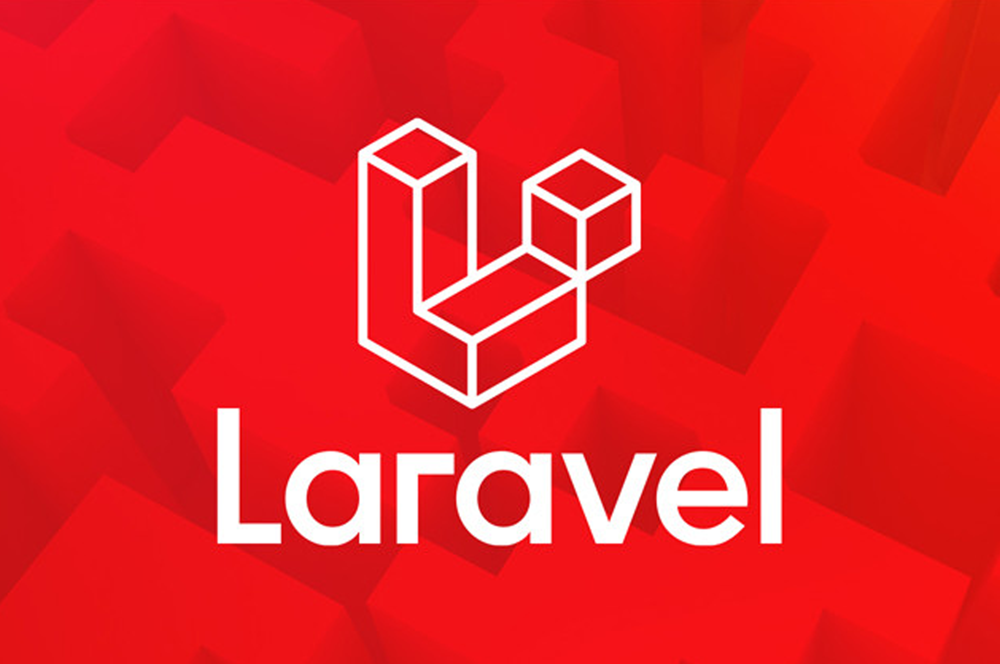

  

## Tópicos

 • <a href="#-sobre-o-projeto">Sobre o Projeto</a>  
 • <a href="#-tecnologias">Tecnologias</a>  
 • <a href="#-autor">Autor</a>  

## Sobre o projeto

Esse repositório é destinado para o estudo do framework de PHP: Laravel

## Tecnologias
Durante o desenvolvimento do estudo e do projeto proposto por curso, as liguagens abaixo também estarão em envidência.

  <!-- HTML 5 -->
  
  <!-- CSS3 -->
  
  <!-- Javasrcript -->
  
  <!-- PHP -->
  
  <!-- Bootstrap -->
    
  <!-- JQuery -->
  

# Entre em contato

**Linkedin**: https://www.linkedin.com/in/marcus-mazza-5a6497190/
Desenvolvido por **Marcus Mazza**
